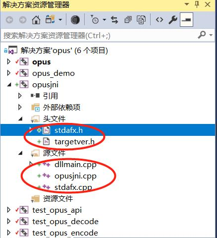
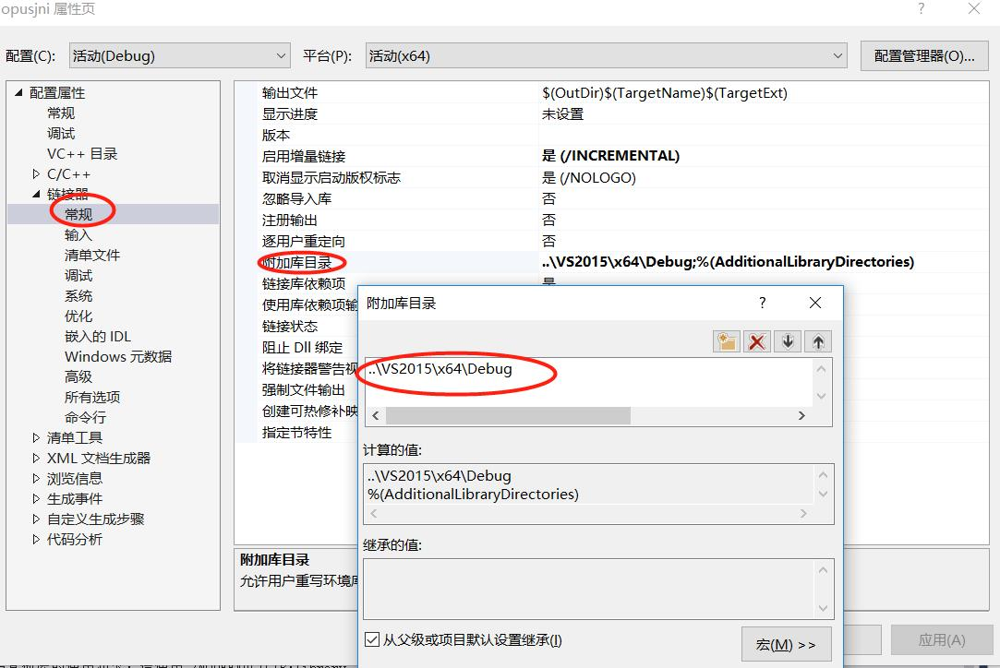
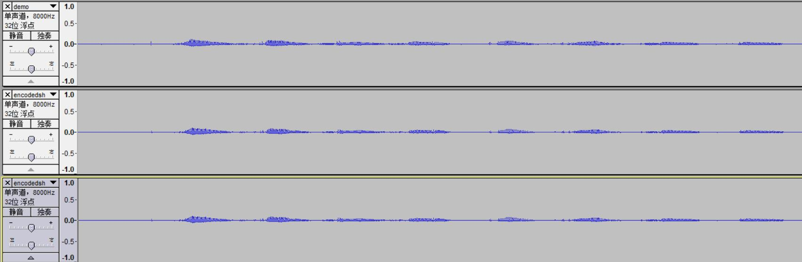

# opus
opus 编解码库在windows、android、linux上使用  

# opus windows上使用

## 软件环境
windows10  
Visual Studio 2017
opus 1.3 下载地址：https://archive.mozilla.org/pub/opus/opus-1.3.tar.gz
eclipse 2018-12
java8

## 使用Visual Studio 2017编译opus库
打开->项目/解决方案->选择win32/VS2015/opus.sln  
检查解决方案操作中使用默认勾选，点击确认  
在解决方案资源管理器中可以看到导入了5个项目  
  
在opus项目上右键->设为启动项目，并配置x64编译  
  
生成->生成opus，在输出窗口可以看到编译过程，编译完成后在win32/VS2015/x64/Debug目录下会生成opus.lib静态库。  

分别将opus_demo、test_opus_api、test_opus_decode、test_opus_encode设置为启动项目并运行，运行过程中没有报错，则说明opus.lib库正确且可用。  

## 定义jni接口，生成.h文件
按照java\opus\src\cn\com\test\opus中OpusEncoder.java和OpusDecoder.java中定义的native接口生成.h文件  
命令如下：  

	java\opus\src目录下
	javah -classpath . -jni cn.com.test.opus.OpusEncoder
	javah -classpath . -jni cn.com.test.opus.OpusDecoder
	生成cn_com_test_opus_OpusEncoder.h和cn_com_test_opus_OpusDecoder.h  

## 创建opusjni工程，生成opusjni.dll库
1. 文件->新建->项目  
   
2. 设置项目，不使用预编译头  
   
3. 删除系统自动生成的源文件和头文件  
   
4. 将上一步中生成的.h文件拷贝到\win32\opusjni目录下，在opusjni工程上右键->添加->添加现有项，将.h文件添加到工程。  
5. 在opusjni工程中创建cn_com_test_opus_OpusEncoder.c和cn_com_test_opus_OpusDecoder.c用来实现jni接口。   
6. 导入jni头文件，在工程上右键->属性   
    
7. 导入opus头文件，在工程上右键->属性，导入如下目录  
..\\..\win32  
..\\..\celt  
..\\..\silk  
..\\..\include  
..\\..  
  
8. 导入opus.lib库，在工程上右键->属性     
添加依赖库目录  

添加依赖库    
   
9. 编译生成opusjni.dll  
生成->生成opusjni，在输出窗口可以看到编译过程，编译完成后在win32/VS2015/x64/Debug目录下会生成opusjni.dll动态库。  
    

## 创建java工程，测试opus编解码
创建opus java工程，按照java\opus\src\cn\com\test\opus目录下源码编写opus测试用例，在opus工程上右键->属性，导入在上一步生成的dll动态库。  
    
运行opus java工程，会在java\opus\src目录下生成 源PCM->opus->PCM文件  
使用软件打开PCM数据进行比较，可以看出音频波形大致相同。  
   

参考：https://www.cnblogs.com/charles04/p/3906102.html  

	